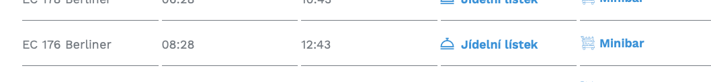

Scroll down for info in English

De gamla (vadå, 1997 var ju alldeles nyss..?) [tjeckiska restaurangvagnarna](https://www.cd.cz/en/nase-vlaky/ec-ic/wrmz/-27281/#kotva) skall ersättas. Men det ser ut som de finns kvar lite till. Missa inte "Happy Hour" med lägre priser så länge tåget är i Tjeckien.

## Hitta tåg

Det lättaste sättet är att söka hos [de som driver restaurangvagnarna](https://www.jidelnivozy.cz/#search)  
då visas _Jídelní lístek_ (meny) med en länk till en pdf-fil som verkar vara olika för olika tåg.

### Alternativa sätt att hitta tågen:

Hitta ett EC (EuroCity)-tåg som går till/från Tjeckien. DB kan filterera fram EC och IC. Du behöver fylla i High-Speed Trains också för att visa RailJet-tåg.

#### Detaljerad tåginfo

Notera tågnumret och sök med det och datum här: [https://www.cd.cz/en/vlak/](https://www.cd.cz/en/vlak/)

Klicka på restaurangvagnen. Om det står "Type: WRmz" är det den gamla typen. Den nyare typen heter "BRmpz". Utöver detta finns ÖBB:s RailJet där restaurangvagnen heter "ARbmpz" och delas med 1:a-klassavdelningen.

### Driftsstörningar

Dagens status för restaurangvagnarna (översatt) [https://m-jidelnivozy-cz.translate.goog/?\_x\_tr\_sl=auto&\_x\_tr\_tl=en&\_x\_tr\_hl=en-US&\_x\_tr\_pto=wapp](https://m-jidelnivozy-cz.translate.goog/?_x_tr_sl=auto&_x_tr_tl=en&_x_tr_hl=en-US&_x_tr_pto=wapp)

### Meny

[exempel på pdf-fil med meny (](https://www.jidelnivozy.cz/uploads/menus/foodMenu/1.pdf))

### Bilder
sist på sidan

## English

The Czech dining cars were intruduced in 1997. Feels like yesterday, right? They are being replaced by new ones. If you want to find which kind of dining car a train has you need to do some investigation.

### Find the correct train type

The easiest way to search is on [this site](https://www.jidelnivozy.cz/#search)  
If there is a dining car, the text _Jídelní lístek_ (menu) is shown with a link to a pdf file that is different for different trains. 

#### Alternate way of finding the dining cars

Find a EC (EuroCity) Train that goes from or to the Czech Republic. DB can filter and include only EC or IC.

When you've found your train, make a note of the train number and search for it (along with your travel date) here: [https://www.cd.cz/en/vlak/](https://www.cd.cz/en/vlak/)

Click on the dining car

If it says "Type: WRmz", it's [the old type](https://www.cd.cz/en/nase-vlaky/ec-ic/wrmz/-27281/#kotva). The new type is "BRmpz". The ÖBB RailJet trains (found under the high speed train filter in DB Navigator) have a dining car type named "ARbmpz".

Daily status for the dining cars (translated) [https://m-jidelnivozy-cz.translate.goog/?\_x\_tr\_sl=auto&\_x\_tr\_tl=en&\_x\_tr\_hl=en-US&\_x\_tr\_pto=wapp](https://m-jidelnivozy-cz.translate.goog/?_x_tr_sl=auto&_x_tr_tl=en&_x_tr_hl=en-US&_x_tr_pto=wapp)

Sample menu: [https://www.jidelnivozy.cz/uploads/menus/foodMenu/1.pdf](https://www.jidelnivozy.cz/uploads/menus/foodMenu/1.pdf)

### Outages

Czech the status of the dining cars today (translated) [https://m-jidelnivozy-cz.translate.goog/?\_x\_tr\_sl=auto&\_x\_tr\_tl=en&\_x\_tr\_hl=en-US&\_x\_tr\_pto=wapp](https://m-jidelnivozy-cz.translate.goog/?_x_tr_sl=auto&_x_tr_tl=en&_x_tr_hl=en-US&_x_tr_pto=wapp)

## Pictures from 2019

A three-course Bohemian Rhapsody on my way to Vienna.

Happy Hour i Tjeckien om jag minns rätt. Gammalt foto, kolla aktuella tider. Happy hour while in Czechia IIRC. Check the current times, this is an old photo.

