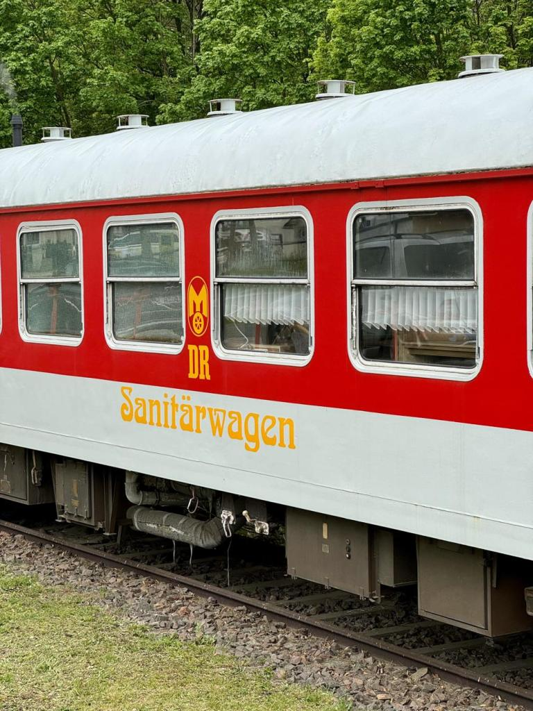
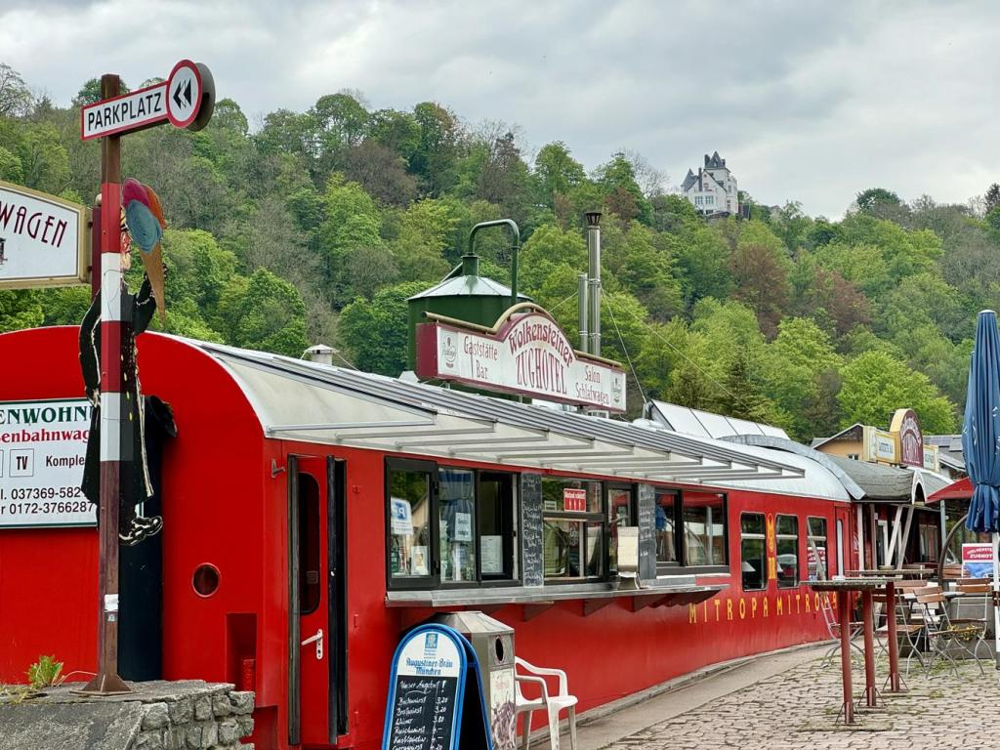
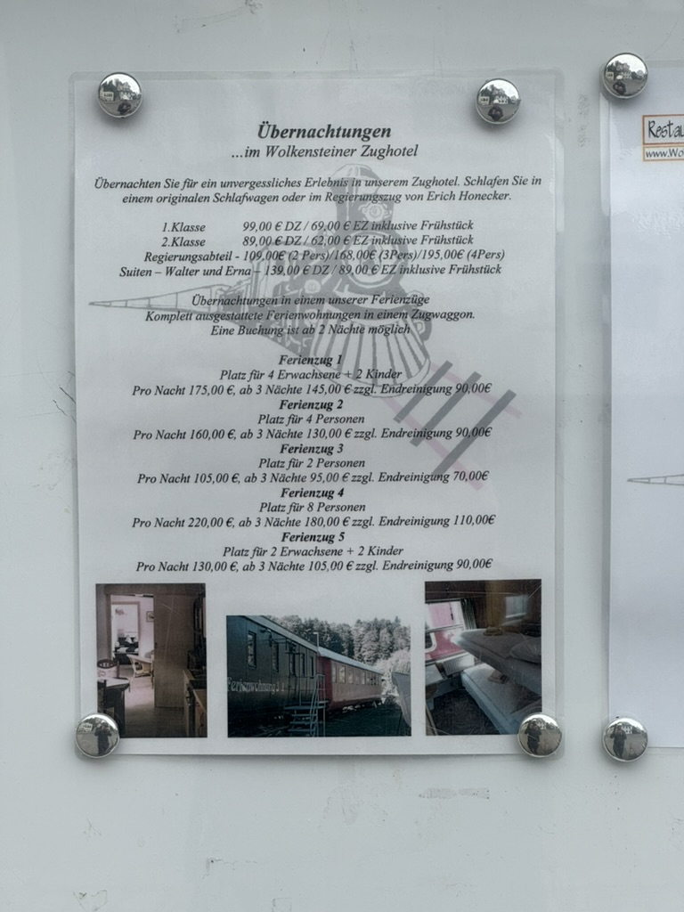
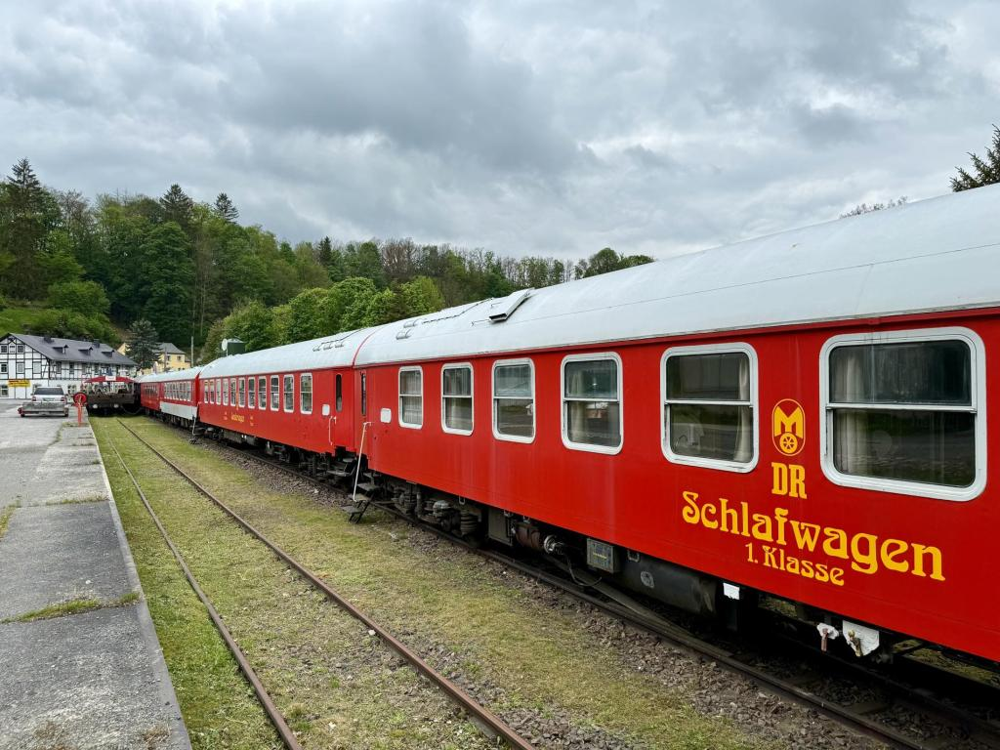
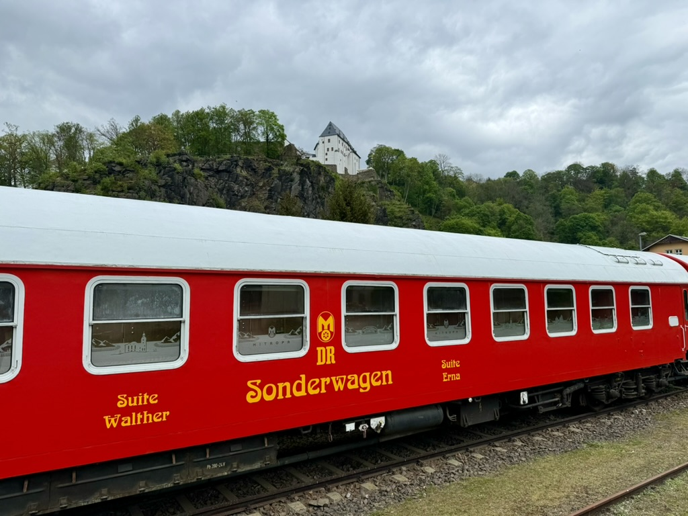
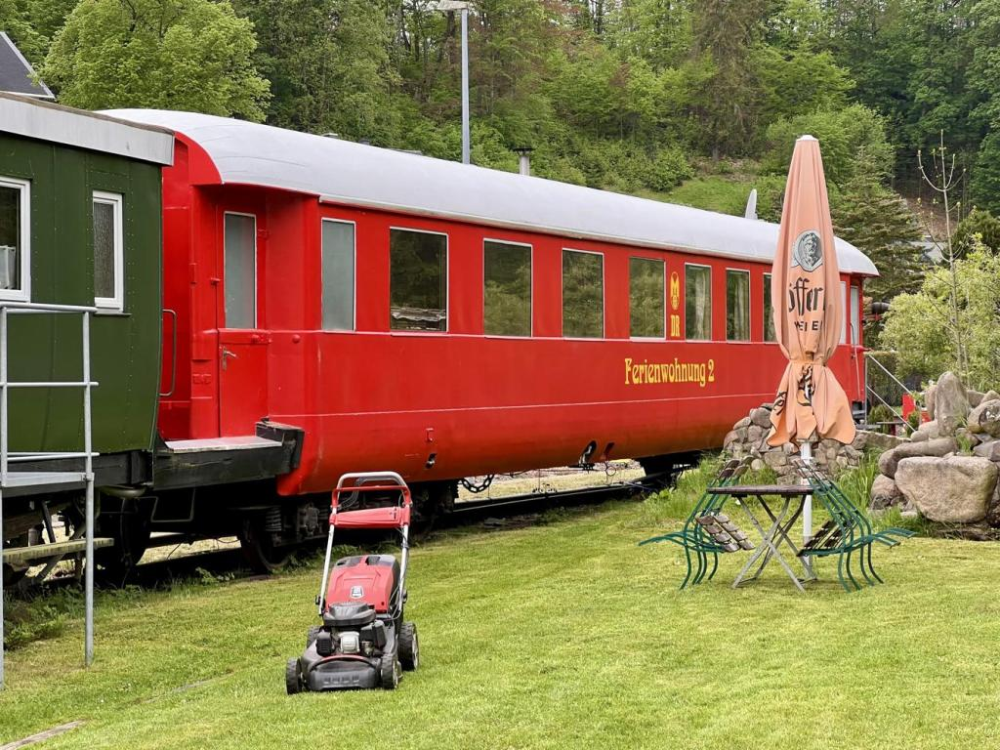
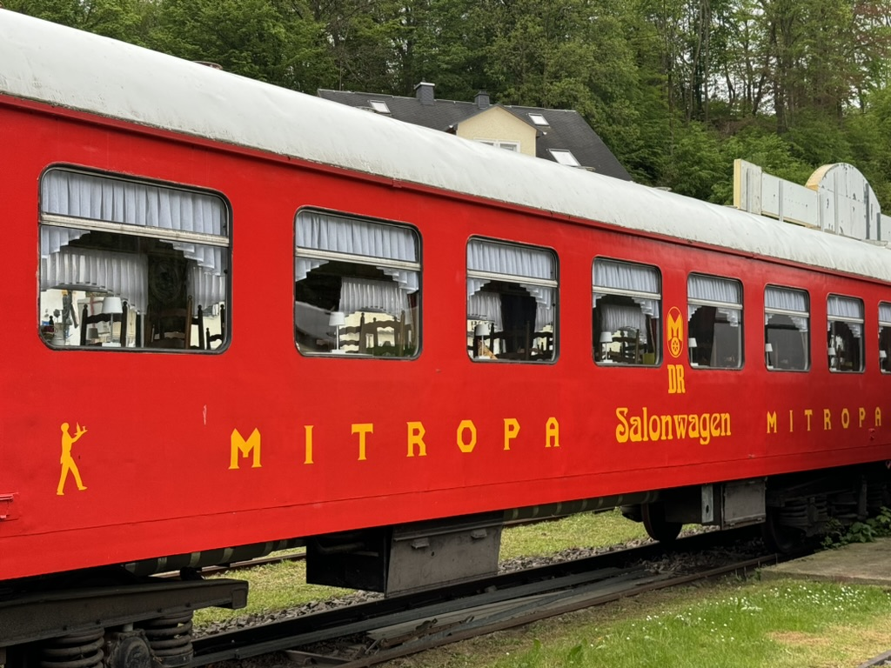
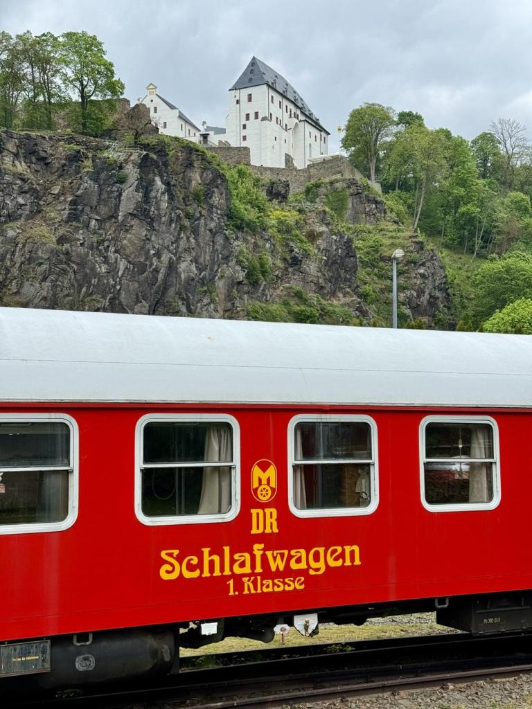
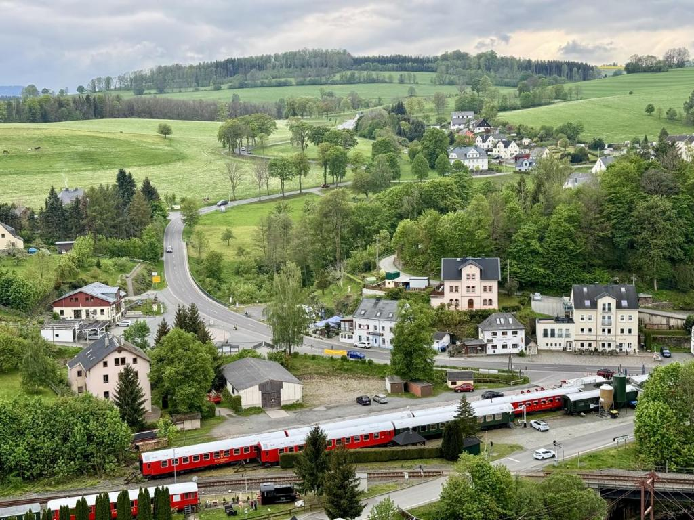

Det är lite märkligt att republiken DDR behöll namnet ["Deutsche Reichsbahn"](https://en.wikipedia.org/wiki/Deutsche_Reichsbahn). Diverse vagnar med _DR_ & _[Mitropa](https://en.wikipedia.org/wiki/Mitropa)_\-målning står uppställda som hotell och "Ferienwohnungen" i Wolkenstein (Sachsen) för den som inte får nog av att trängas i nattågs-kupéer. Kanske "Suite Walther" (Ulbricht?) i en "Sonderwagen" har lite mer svängrum. Jag såg det när jag tog ett tåg upp mot tjeckiska gränsen och kollade in det på tillbakavägen. Tåg i 1-timmes-trafik gör det rimligt att ta en promenad och sen åka vidare. [Das Wolkensteiner Zughotel](https://wolkensteiner-zughotel.de) heter det. De har gjort om rejält inuti vagnarna enligt bilderna där. "Sanitärwagen" verkar vara ett sätt att slippa ha toaletter i de vanliga vagnarna.

F.d. Mitropa-kontor + Zwickau Hbf

Östtyskt "TEE" som det verkar samlas pengar till att rusta upp (jag såg affischer på stationen i Zwickau men vet inget mer om det) [https://svt-goerlitz.de/en/](https://svt-goerlitz.de/en/) Det stod utanför Chemnitz bland diverse vrak. [https://de.m.wikipedia.org/wiki/DR-Baureihe\_VT\_18.16](https://de.m.wikipedia.org/wiki/DR-Baureihe_VT_18.16)

