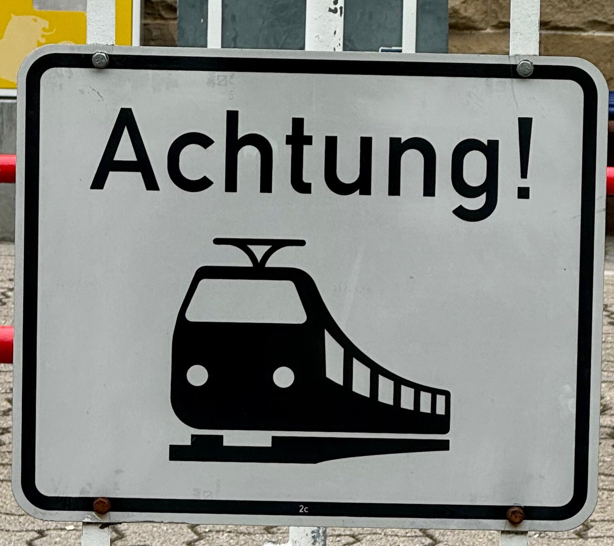

Lite bilder och reflektioner efter drygt två veckor resande i Tyskland med Deutschlandticket.

## Sajt-uppdateringar

- Baskiska Euskotrens tidtabeller finns numera på fler ställen än deras egen sajt. [(Spanien)](https://www.trainfo.eu/spanien/)

- En hel del uppdateringar på sidan om [Deutschland-Ticket](https://www.trainfo.eu/deutschland-ticket/) efter denna resa.

- Förra [uppdateringsinlägget](https://www.trainfo.eu/2024/04/21/ny-sida-deutschlandticket/) är fortfarande relevant.

- [Eget inlägg med DDR-tåg](https://www.trainfo.eu/2024/05/11/ostalgie/)

- Instruktioner på [engelska](https://www.trainfo.eu/interrail-in-sweden/) för Sverige

- [”Första resan”](https://www.trainfo.eu/forsta-resan/) är fortfarande den mest lästa sidan. Glädjande, för då är chanserna stora att många förstagångs-tågresenärer har fått hjälp med sin planering. Och Italien är fortfarande det land det läses mest om.

## Das Tåglüff

Jag kollade detaljer och skrev ihop fakta och tips kring [Deutschland-Ticket](https://www.trainfo.eu/deutschland-ticket/) när jag bestämt mig för att åka. Några dars framförhållning räckte, jag hade kunna köpa nattågsbiljetten till Berlin samma dag jag skulle resa och det hade blivit en hundring billigare.

Jag hade inte så jättemycket planer förutom att hålla mig till mindre städer. Jag valde också nattåg från (Snälltåget) och till (SJ) Sverige för att slippa Hamburg. Några enstaka övernattningar på olika ställen, några fler nätter med dagsutflykter på andra ställen. Första gången bortom Köpenhamn utan Interrail. Snälltåget hade riktiga sängkläder, SJ har betydligt enklare.

Det funkade väldigt bra, jag hamnade inte på nåt av de ”förbjudna tågen” och jag testade några av de tåg som gick utanför Tyskland (🇵🇱, 🇱🇺 , 🇫🇷 ) liksom ett InterCity som ”extraknäcker” som regionaltåg på en del av sin sträckning:

<figcaption>

Tåget har både IC-nummer och RE-nummer

</figcaption>

<figcaption>

DB Fernverkehr där D-Ticket uttryckligen gäller

</figcaption>

### Enkelt

Det tog några dar innan ”interrail-vanorna” var borta, det är ingenting som behöver göras innan påstigning. Inga tåg behöver registreras. Ingen resdag behöver aktiveras. Också väldigt skönt att kunna åka med lokaltrafik utan att behöva sätta sig in i zoner och hur biljetter köps. Skönt att komma ut från stationen och bara ta en buss eller spårvagn mot stadens centrum.

## Gammalt och nytt

**Nyaste tåget**

InterCity Rottweil - Stuttgart (Regionaltåg Singen - Stuttgart, IC och förbjudet resten) Fräschare och bekvämare variant av dubbeldäckarna med mer plats vid sätena. Luktade fortfarande nytt.

Det hade en pissoar på toaletten (dvs toalettstol och pissoar i en vanlig liten tågtoa) så herrarna inte behöver spraya toalettstol och golv.

**Äldsta tåget**

Crailsheim - Ansbach. Gammalt skramligt loktåg med krångliga dörrar. Nåt för den som tycker det var bättre förr.

Annars var det hyfsat moderna motorvagnståg, tyvärr är många perronger anpassade för högre insteg (lokdragna vagnar), så det blev ofta ett kliv ned i tåget och upp på perrongen.

Det är lite skillnad i slingrighet på regionaltågens spår längs floderna och höghastighetsbanorna med sina broar och tunnlar. Regionaltåg längs floden Fulda på väg mot Kassel.

### Kliv av och kolla var du kan bo

Utanför stationer på mindre orter fanns ibland en skylt med vilka hotell mm som finns på orten.

## Färja

<figcaption>

St. Goarshausen på andra sidan Rhen.

</figcaption>

Jag åkte färja över Rhen, tyvärr slutade D-Ticket gälla på denna färja sista april. Jag glömde fråga om det var för alltid eller bara i högsäsong. På ett annat rederi (KD) gällde den inte alls. Det är bara att kolla efter nån skylt eller fråga. den lokala turistinformationen kan säkert hjälpa till om du vill planera.

## Resan

Stockholm - Berlin. Snälltåget. Uppgraderade till egen kupé, det fanns flera lediga.

Berlin - Cottbus - Görlitz

<figcaption>

Görlitz från Zgorzelec

</figcaption>

<figcaption>

Zgorzelec från Görlitz

</figcaption>

Görlitz - Zittau - Zgorzelec i Polen (andra sidan floden, gick tillbaka till Görlitz). Deutschland-Ticket gällde til Zgorzelec. Floden Neisse blev gräns 1945 när Polen "flyttades västerut".

<figcaption>

Görlitz bahnhof

</figcaption>

<figcaption>

Zittau

</figcaption>

Görlitz - Weimar. Jag valde Bauhaus-Museet istället för koncentrationslägret Buchenwald.

<figcaption>

Bauhaus-museet i Weimar

</figcaption>

Weimar - Giessen

<figcaption>

Gågata, Karstadt...väldigt (Väst)Tyskland

</figcaption>

Giessen - Koblenz

Koblenz - Luxemburg - Gerolstein - Koblenz

<figcaption>

Luxembourgs Gare Centrale

</figcaption>

<figcaption>

"Gerolsteiner Dolomiten"

</figcaption>

Koblenz - Limburg - Kaub - Koblenz

<figcaption>

Bad Ems. För de som dagligen tänker på romarriket kan det vara intressant att veta att här gick Limes, gränsen mot de germanska barbarerna.

</figcaption>

Koblenz - Wissembourg (FR) - St Georgen(Schwarzwald)

<figcaption>

Korsvirkeshus i Wissembourg i Alsace. Stork sågs från tåget.

</figcaption>

St G - Donaueschingen - Konstanz - St. G.

<figcaption>

Donaus källa

</figcaption>

St G - Freiburg - Titisee - Rottweil - St G

<figcaption>

Hundfritt Rottweil

</figcaption>

St G - Freudenstadt - St G

St G - Ansbach

Ansbach - Klingenthal - Zwickau

Zwickau - Johanngeorgenstadt - Chemnitz - Zwickau

<figcaption>

Chemnitz. Gammalt och nytt.

</figcaption>

Zwickau - Cranzahl - Wolkenstein - Augustusburg (bergbana) - Zwickau

<figcaption>

Cranzahl

</figcaption>

<figcaption>

"Drahtseilbahn" till Augustusburg

</figcaption>

<figcaption>

Wolkenstein

</figcaption>

Zwickau - Magdeburg (som har fått ett verb skapat efter stadsnamnet. ["Magdeburgisieren"](https://goranredin.wordpress.com/2013/05/15/dagens-tyska-verb-ar-magdeburgisieren/))

<figcaption>

"Grüne Zitadelle" i Magdeburg, desigat av Friedensreich Hundertwasser

</figcaption>

Magdeburg - Potsdam - Berlin - SJ Nattåg till Stockholm.

Danskarnas gränskontroll vid midnatt var en halvmesyr där de gapade om "passport and id control" (skönt för oss som har Nationellt ID-kort att de inte bara gastade om "passport" 😅) men sen kollade de inte alla kupeér. Och även om de gjort det skulle det kunna sitta en hel familj på "bagagehyllan" över dörren. Sen gick det på folk i Köpenhamn vid 4 på morgonen, borde inte vara möjligt men tydligen lyckades de köpa en sån biljett.

### Uppkoppling

Tyskland är inte det första man tänker på när det gäller snabb och stabil uppkoppling från mobilen. Det blir inte bättre längs regionaltågssträckor mellan småbyar. Men Fahrplaner-appen funkar offline.

## Bildspel

https://vimeo.com/945431946?share=copy

## Slutsats

Det var ett nytt sätt för mig att resa som jag gärna gör om. Enkelheten är väldigt tilltalande och det var kul att se lite mer av Tyskland, speciellt de östra delarna där jag knappt varit tidigare. Bara i Dresden och vid Basteibrücke. Det kanske blev lite långa etapper ibland, en ovana från Interrails resdagar och en ivrighet att se mycket.

Jag lade in tågen i RailPlanner för att få dem på karta och med summering.

## Rese-idé

Följ Donau från dess källa i Donaueschingen i Schwarzwald till Svarta Havet. Deutschland-Ticket gäller till Passau.

### Uppdaterat

[Fakta-sidan om Deutschland-Ticket](https://www.trainfo.eu/deutschland-ticket/) är uppdaterad
